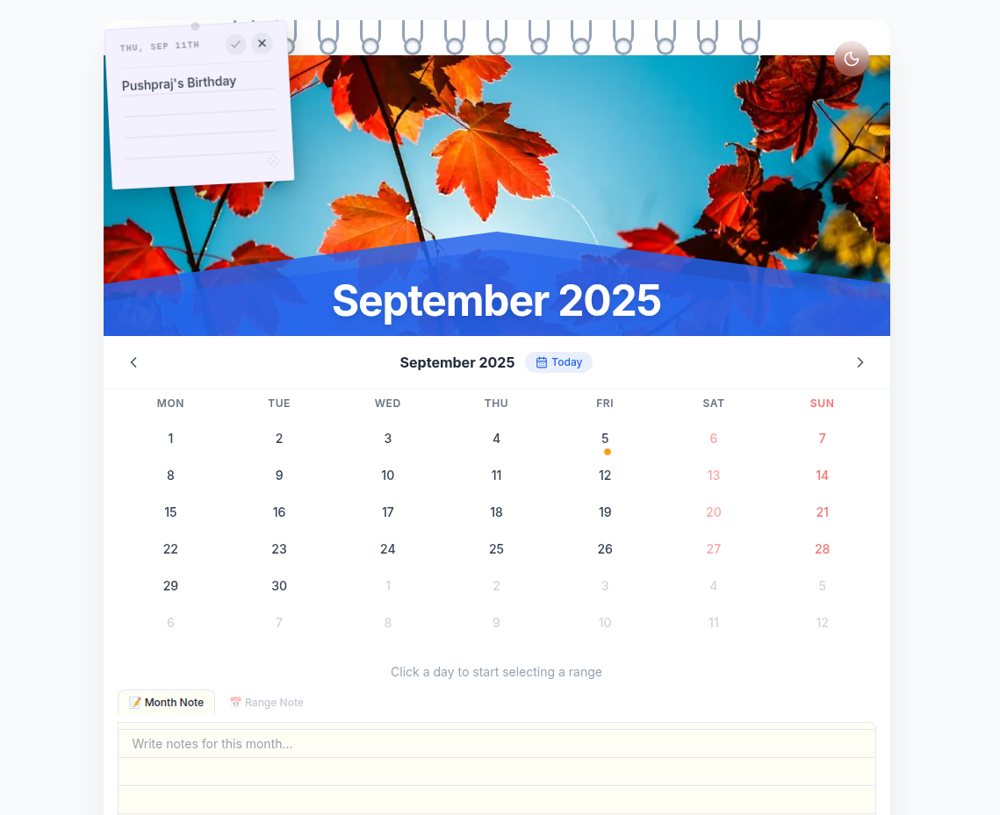

# TUF Calendar — Wall Calendar Component

A premium wall calendar component built with Next.js 14 (App Router) + TypeScript. Client-side only — no backend, no API routes, no database.



## 🚀 Setup

```bash
npm install
npm run dev
# Open http://localhost:3000
```

## 🏗️ Architecture

```
src/
├── app/
│   ├── layout.tsx          # Root layout (Inter font, SEO meta)
│   ├── page.tsx            # Renders CalendarRoot
│   └── globals.css         # CSS variables, notepad lines, bindings
├── components/Calendar/
│   ├── CalendarRoot.tsx     # Main orchestrator (keyboard nav, flip anim, dark toggle)
│   ├── HeroPanel.tsx        # Unsplash hero + SVG chevron + month title
│   ├── BindingRing.tsx      # Decorative spiral binding (pure CSS)
│   ├── MonthNav.tsx         # Prev/Next arrows + Today + mini-month popover
│   ├── CalendarGrid.tsx     # 7-col grid with day cells
│   ├── DayCell.tsx          # Single day (selection, holidays, a11y, note trigger)
│   ├── HolidayDot.tsx       # Amber dot + Radix tooltip
│   ├── StickyNote.tsx       # Draggable floating note (GSAP Draggable)
│   ├── NotesOverlay.tsx     # Layer for floating notes per month
│   ├── RangeSummaryBar.tsx  # "Mar 3 → Mar 14 · 12 days selected"
│   └── NotesPanel.tsx       # Tabbed notepad (month/range, auto-save)
├── store/
│   └── calendarStore.ts     # Zustand + persist (localStorage)
├── hooks/
│   ├── useRangeSelection.ts # Click cycle + tooltip text
│   ├── useImageTheme.ts     # Canvas color extraction → CSS var
│   └── useHolidays.ts       # Holiday lookup
└── lib/
    ├── holidays.ts          # Indian public holidays map
    ├── dateUtils.ts         # date-fns wrappers
    └── utils.ts             # cn() = clsx + tailwind-merge
```

## ✨ Features

| Feature | Details |
|---------|---------|
| **Wall Calendar Aesthetic** | Spiral binding, hero image, SVG chevron accent |
| **Interactive Sticky Notes** | Draggable (GSAP), color-coded, persistent, & month-scoped |
| **Range Selection** | Click-to-select with auto-swap, connecting bar |
| **Page-Flip Animation** | Framer Motion rotateY + perspective on month change |
| **Dynamic Theming** | Canvas pixel sampling → accent color from hero image |
| **Holiday Markers** | 23 Indian public holidays with tooltip on hover |
| **Mini Month Preview** | Radix Popover on nav arrow hover |
| **Keyboard Navigation** | Smart arrow keys & Space handling (respects text inputs) |
| **Dark Mode** | Full dark/light toggle, persisted to localStorage |
| **Notes** | Month + Range tabs, auto-save on blur, 500 char limit |
| **Responsive** | Desktop card (max 900px) / mobile full-width |

## 🛠️ Tech Stack

- **Next.js 14** (App Router) + **TypeScript** (strict)
- **Tailwind CSS v3** + tailwind-merge + clsx
- **Framer Motion** (page-flip, presence animations)
- **GSAP + Draggable** (physics-based dragging for sticky notes)
- **Zustand** (state + localStorage persist)
- **date-fns** (all date logic)
- **Radix UI** (Tooltip, Popover)
- **lucide-react** (icons)

## 🎯 Design Decisions

1. **`onPointerDown` over `onClick`** — unified mouse + touch support
2. **`crossOrigin="anonymous"` on hero image** — enables canvas color extraction
3. **`perspective: 1200px` wrapper** — page-flip only on inner grid, not entire layout
4. **`clickCount` reset on rehydration** — prevents stale half-selections across refreshes
5. **Notepad `repeating-linear-gradient`** — matches physical lined paper with dark mode variant
6. **Smart Keyboard Events** — navigation listeners check `Event.target` to avoid hijacking keys during text input
7. **`gsap.context()` for cleanup** — ensures Draggable instances are destroyed and recreated correctly on React re-renders
8. **No `any` types** — strict TypeScript throughout with defined interfaces
